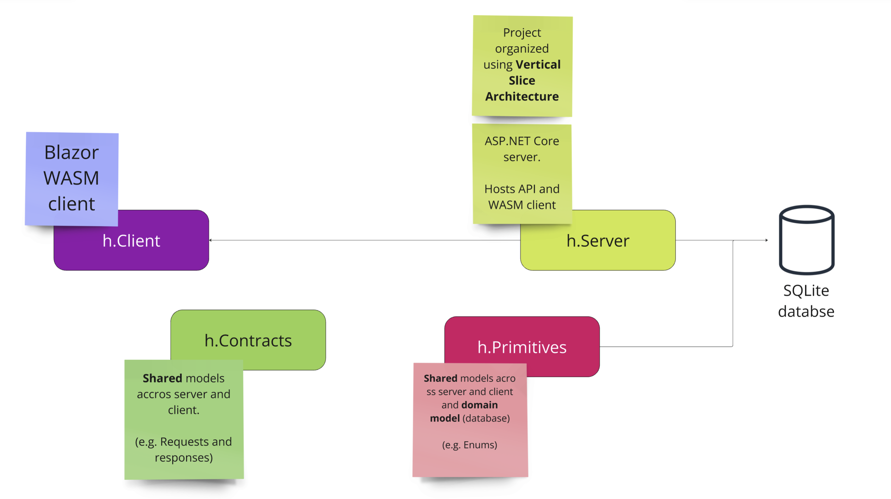

<h1 align="center">Tour de App tým h</h1>
<p align="center">
    
</p>

## TdA25
### Členové týmu h

| **Člen týmu**                                  | **Pozice**        |
|------------------------------------------------|-------------------|
| [Klára Futejová](https://github.com/futejo-k)  | Frontend          |
| [Martin Fiala](https://github.com/Xopabyteh)   | Fullstack         |
| [Jonáš Holub](https://github.com/Kolombooo)    | Design a frontend |

### Využité technologie
- Server: **ASP.NET Core**  (with Minimal APIs)
- Prezentace: **Blazor Web App** (Server + WASM + prerendering)
- ORM: **Entity Framework Core**
- Databáze: **SQLite**

### Využité nástroje
- Miro: Pro wireframe, vedení todo listu, brainstorming
- Figma: Pro design
- GitHub: Pro správu kódu, ci/cd
- Discord: Pro komunikaci

## Dokumentace
### Spouštění
> Při spuštění se spustí EF Core migrace, což sice není dobrá praxe,
ale pro účely této aplikace je to dostačující.

#### Visual studio:
Since it is a Blazor web app, with both rendering options (Server and WASM), the `h.Server` project must be launched.

In vs, there are two options:
* Either the `h.Server` and run the `https` launch profile,
* or better select `docker-compose`.

#### Docker:
The project can be run in a docker container. The `docker-compose` file is included in the project.

#### CLI:
The project can be run from the CLI. The `h.Server` project must be launched
with the https launch profile:
```bash
$ dotnet run --project src\h.Server\h.Server.csproj --launch-profile https
```

### Architektura


#### Ukázky některých procesů (simplified)


